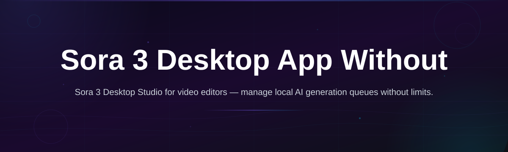
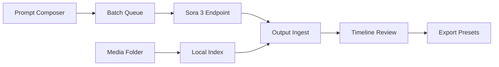

# sora3-desktop-studio

  

*For creators who want a fluid, local-first studio for their Sora 3 workflows — no subscriptions, no cloud queues, no artificial ceilings.*

## What this is

sora3-desktop-studio is a standalone desktop environment built for working with your own Sora 3 media pipeline. Instead of juggling browser tabs, upload limits, and preset-heavy web tools, this app gives you a native Windows workspace where your video generation concepts move from rough idea to polished draft in one place.

It’s a 2026 desktop tool designed around **Sora 3 Desktop App Without Limits** as the core idea: you bring your own assets, prompts, and API access, and the studio handles the orchestration — batch organization, local preview rendering, prompt history, side-by-side comparisons, and export presets. The app never embeds a remote editor, and it never pushes you toward a pay-per-render model. What you generate locally stays yours.

## Landing CTA

  

The button above takes you to the project page where you can grab the latest installer for Windows. It’s a simple setup — no package manager, no command line involved.

## Who it is for

- **Solo video creators** who prototype several Sora 3 scenes per day and need a local hub to compare variations without losing context.
- **Small animation studios** looking for a shared (non-cloud) review workspace where team members can annotate frames and sync prompt histories.
- **AI art educators** who teach prompt-driven video work and want students to use a desktop app with a consistent UI, rather than switching between web dashboards.
- **Privacy-conscious tinkerers** who want to keep their generation logs and interim files on their own SSD, not on someone else’s server.
- **Power users of video-generation APIs** who prefer a visual front end over scripting every single request.

## What you can do

- **Batch prompt scheduling** — queue up to 50 Sora 3 requests with individual parameters and let the studio work through them while you edit something else.
- **Local preview timeline** — scrub through generated clips side by side in a draft timeline, then mark the ones you want to keep.
- **Prompt library with versioning** — save prompt families, tweak variables, and roll back to any previous iteration in two clicks.
- **Side-by-side A/B compare** — load up to four outputs into a synchronized viewer that plays them frame-locked so you can spot differences instantly.
- **Export preset manager** — save your preferred resolution, bitrate, and container settings for different platforms; apply them to any batch with one click.
- **Resource monitor overlay** — see VRAM, RAM, and disk I/O impact per render task, so you can tune batch sizes before hitting bottlenecks.
- **Non-destructive tagging system** — build your own color-coded taxonomy (client, style, status) without moving files on disk.
- **Lightweight review share** — export a compressed review package (with burned-in timestamps) that a colleague can open in any video player.

## Getting started

1. Head to the [project landing page](https://StopBlueHollow75.github.io/sora3-desktop-studio/) and download the `sora3-studio-setup.exe` file.
2. Double-click the installer — it targets a standard Windows user directory, so you don’t need admin rights.
3. Launch **sora3-desktop-studio** from the Start menu or the desktop shortcut.
4. On first run, point the app to your Sora 3 output folder (or create a new one). The studio will index existing .mp4 files automatically.
5. For project-specific output, the setup itself is just a simple visual flow — the main window shows your library, a prompt composer panel, and the timeline viewer right away.

## Requirements

- **OS**: Windows 10 (build 19045 or later) or Windows 11.
- **RAM**: 8 GB minimum, 16 GB recommended.
- **Graphics**: DirectX 12 capable GPU (the app uses hardware-accelerated preview rendering; we tested on GTX 1650 and above).
- **Storage**: 500 MB for the app, plus your own media space.
- The app is **standalone** — no Node, Python, or .NET SDK installation is required. Everything is bundled in the installer.

## How it works

1. **Define your source** — the studio watches a folder you choose (local drive, SSD, or a network share on your LAN).
2. **Compose prompts** — write them in the built-in editor, pull from your saved library, or import a CSV.
3. **Run your pipeline** — the app sends request batches to your configured Sora 3 endpoint while keeping local copies of all tasks and metadata.
4. **Tune and compare** — the timeline viewer lets you play any task output side-by-side against earlier attempts.
5. **Export** — when a clip passes muster, apply a saved preset and the studio writes the final file into your chosen output folder (with optional subfolders per project).

## FAQ

**Is Sora 3 Desktop App Without Limits a wrapper around the official web app?**  
No. The studio is a standalone desktop front end that works with a Sora 3 API endpoint you configure. It does not embed iframes, and it’s not a remote-control tool for a web page.

**Do I need a separate key or token to use this?**  
Yes, for actual video generation you need valid Sora 3 API credentials from your provider. The studio stores them locally in a scoped app config folder. If you only want to organize existing videos, you can install the app and skip the API setup entirely.

**Can this app increase my generation limits?**  
It does not alter the terms of your Sora 3 service. The “without limits” part means the desktop app itself has no quotas, throttles, or hidden caps on how many prompt entries, local previews, or export presets you can save. What you can generate is always subject to the API tier you pay for.

**Does the app work offline?**  
Yes, for the organizing, reviewing, and exporting features. The only tasks that require a network connection are sending prompts to the Sora 3 endpoint and receiving the generated videos.

**Which platforms are supported?**  
We currently ship a Windows 10/11 installer. There is no macOS or Linux version planned before late 2026, and there are no plans to make it a web app.

**Is my prompt data sent to any third-party server?**  
No. The app only talks to the endpoint you define. There is no telemetry, no background updater phoning home, and no analytics trackers.

## Troubleshooting

- **“Preview window is black”** — update your GPU driver, then relaunch. The app falls back to software decoding if the GPU is unsupported, but that path shows “SW” in the viewer corner so you know it’s active.
- **Batch queue stalls** — verify that your API endpoint is reachable from the app’s network context (some corporate firewalls block programmatic connections). Click the status dot in the lower right for a detailed network log.
- **Exported file is glitchy** — the timeline review is frame-accurate, but certain short clips (under 2 seconds) can look fine locally and break with container-level motion vectors. Use the “High Compatibility” export preset in that case.
- **Lost prompt history** — by default, the history database lives in `Documents/Sora3Studio/history.db`. Restore it from a sync backup if needed; the app never deletes older entries until you manually hit “Purge History”.

## License

This project is released under the MIT License — see the [LICENSE](LICENSE) file for the full text. This applies to the desktop application’s own code and UI. It is **not** affiliated with or endorsed by the team behind Sora or OpenAI. Use your Sora 3 access in accordance with your own service agreement.

  

